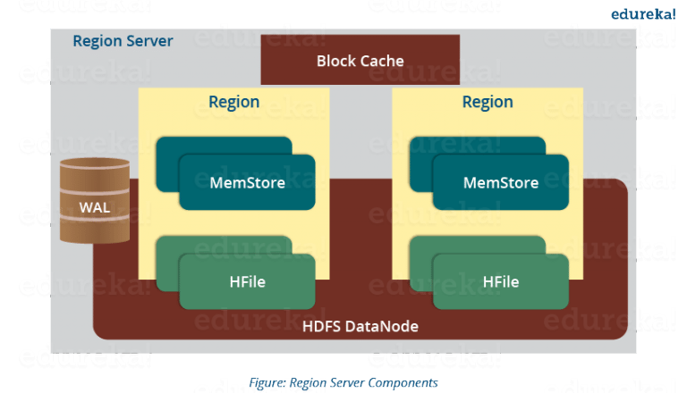

## Components 

* **HMaster server** 
    * Acts as NameNode in HDFS
    * Handles and manage Region Server 
    * Performs DDL operations 
    * Assigns regions to Region Servers 
    * Performs recovery activities
* **HBase Region server:** 
	* Responsible for handling, manging, executing reads and writes operations on the set of regions 
	* Regions : 
		- contains all the rows between the start jey and the end key 
		- Hbase table can be divied into a number of regions in such way that all the columns of family is stored in one region 
		- Each region contains the rows in sorted order 
		- Many regions are assigned to a Region Server 
		- Default size of region is 256 MB which can be configured 

* **Zookeeper** 
	* Acts as a coordinator inside HBase
	* Helps in maintains servers states. Servers send heartbeat to Zookeeper
	* Maintains .META server's path 
		
* **Region Server** 

    
    
    * ***Block Cache***
	    * It stores in the memory the frequently accessed data  
		* If the data in BlockCache is least recently used, then that data is removerd from BlockCache
	* ***WAL (Write Ahead Log)*** 
	    * Is a file attached to every Region Server 
		* Stores a new data hasn't been persisted or commited to permanent storage 
		* It is used in case of failure to recover data sets
	* ***MemStore*** 
	    * It is the write cache store 
		* It stores all the incoming data before commiting it to the disk or permanant memory 
		* There is one MemStore for each column family 
		* The data is sotred in lexicographical order before commiting it to the disk 
    * ***Hfile*** 
		* It stores data to cells on the disk
		* MemStore commit the data to Hfile when the size of MemStore exceeds
				
* **Read Mecanism:**
* **Write Mecanism:**
				

https://blog.engineering.publicissapient.fr/category/cloud/
