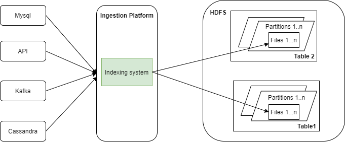

## Best practice
- Use Event-Sourcing to facilitate backups (store now, analyze later)
- Layer data based on user’s skills (data analytic, engendering, ...)
- Keep the Datalake open (avoiding vendor lock-in, or overbalance on a single tool or database)
- Plan for performance
- https://www.upsolver.com/blog/four-principles-data-lake-architecture

## Example of data ingestion in Uber
- Decouple storage from query layer, each can be scaled independently
- Two dataset types
    - Append-only
    - Append-plus-update
    
- Challenges
    - Not read the hole dataset
    - Spread across multiple files within partitions to leverage high parallelism during writes and in case
    of files updates, limiting write footprint only to the files containing these updates
    - For efficient updates: lookup tool (<u>lookup table</u>) for location of the data with the Big data platform

      
    - The indexing system that maybe used **HBase** or **Cassandra** 

