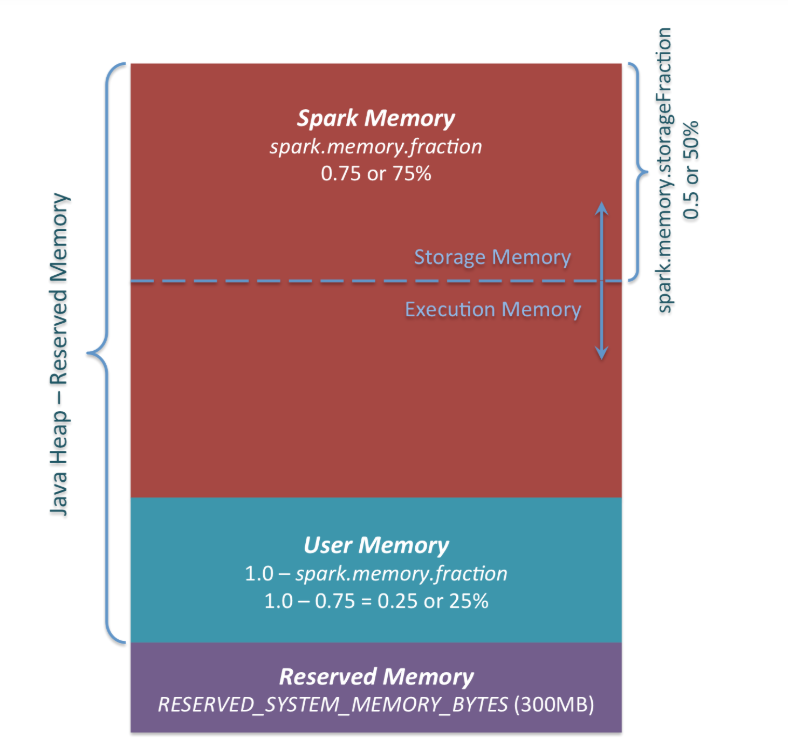

# Memory

## Executor memory

#### On-heap

* **Spark Memory (spark.memory.fraction)**
   * **Storage Memory (spark.memory.storageFraction) :** used to store Spark cache data, such as RDD cache, Broadcast variable, Unroll data (process of deserializing a serialized data), and so on.
   * **Execution Memory:**  used to store temporary data in the calculation process of Shuffle, Join, Sort, Aggregation, etc
* **User Memory:** It's mainly used to store the data needed for RDD conversion operations, such as the information for RDD dependency
* **Reserved Memory (300MB):** The memory is reserved for system and is used to store Spark's internal objects
   * Spark fail if we don't give executor memory at least 1.5 * Reveserved Memory = 450MB
  

  
  

## Cache and Repartition 
- Cache: use MEMORY_AND_DISK storage level.
- Persist: the storage level can be changed.
- Cache and persist are lazy operations (transformations)
- Spark drops persisted data if not used or by using least-recently-used (LRU) algorithm.