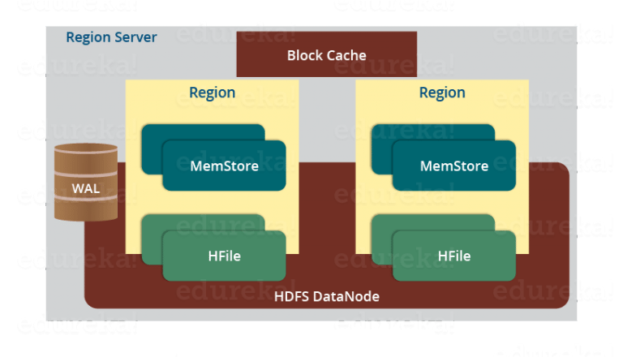

## Components 

- **HMaster server**
    - Acts as NameNode in HDFS
    - Handles and manage Region Server
    - Performs DDL operations
    - Assigns regions to Region Servers
    - Performs recovery activities

- **HBase Region server**
	- Responsible for handling, manging, executing reads and writes operations on the set of regions
	- Region
		- Contains all the rows between the start key and end key
		- Hbase table can be divided into a number of regions in such way that all the columns of family
		  is stored in one region
		- Each region contains the rows in ***sorted order***
		- Many regions are assigned to a Region Server
		- Default size of region is **256 MB** which can be configured
		- They are automatically scaled when they become large, or they can be also merged
		- **Recommendations**
			- 10 to 10000 regions per region server
			- Between 1 GB to 2 GB per size for each region 

- **Zookeeper**
	- Acts as a coordinator inside HBase
	- Helps in maintains servers states. Servers send heartbeat to Zookeeper
	- Maintains .META server's path
	- Region servers are created as ephemeral nodes, once they fail to send heartbeat the node are deleted
		
- **Region Server**

  
    
    - **Block Cache**
	    - It stores in the memory the frequently accessed data  
		- If the data in BlockCache is least recently used, then that data is removed from BlockCache
	- **WAL (Write Ahead Log)**
	    - Is a file attached to every Region Server
		- Stores a new data hasn't been persisted or committed to permanent storage
		- It is used in case of failure to recover data sets
	- **MemStore**
	    - It is write cache store
		- It stores all the incoming data before committing it to the disk or permanent memory
		- There is one MemStore for each column family
		- The data is stored in lexicographical order before committing it to the disk
    - **Hfile**
		- It stores data to cells on the disk
		- Persistent, ordered and  immutable, it maps keys to values
		- Default size **64 KB**  
		- MemStore commit the data to Hfile when the size of MemStore exceeds
				
- **Read Mechanism**
- **Write Mechanism**


## Data Model
- **Table:** is made of set columns and rows
- **Row:** addressed uniquely by ***row key****
- **Column family:** set of column
- **Column** 
  	- Small unit in HBase
  	- May have multiple **versions** 
	- **Version**
	  	- Distinct the values contained in **cells**
		- They are stored in decreasing timestamped order which helps to retrieve the newest value first
		- User can specify the number of version to keep
	
```
SortedMap<RowKey, // first map --> is table (map row keo to list of CF)
	List<SortedMap<Column, // first list --> CF, second map --> (map column to list of values) 
		List<Value, Timestamp>>>> // second list --> List of values and ts
``` 

## Notes

- Sparse
- wWide tables 
- Column-oriented 

Often eliminate the to normalize data, and the **Join** operations cost needed to aggregate data
  
- Use of intelligent keys gives fine-grained control over how - and where data is stored.

- Set large memory for region servers, could sometimes be dangerous, because of GC


