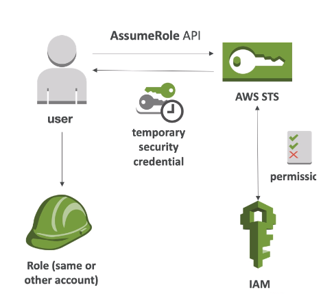

# Security Token Service (STS)

- Allows to grant limited and temporary access to AWS resources
- Token is valid for up to one hour (must be refreshed)
- Is the service that you can use to create and provide trusted users with temporary security credentials
  that can control access to your AWS resources.
- Temporary security credentials work almost identically to the long-term access key credentials that your IAM users can use.
- You can use the AWS Security Token Service (AWS STS) to create and provide trusted users with temporary security
  credentials that can control access to your AWS resources.
- Temporary security credentials work almost identically to the long-term access key credentials that your IAM users
  can use, with the following differences:
  - Temporary security credentials are short-term, as the name implies. They can be configured to last for anywhere from a few minutes to several hours.
  - After the credentials expire, AWS no longer recognizes them or allows any kind of access from API requests made with them.
  - Temporary security credentials are not stored with the user but are generated dynamically and provided to the user when requested.
  - When (or even before) the temporary security credentials expire, the user can request new credentials,
  as long as the user requesting them still has permissions to do so.

  
