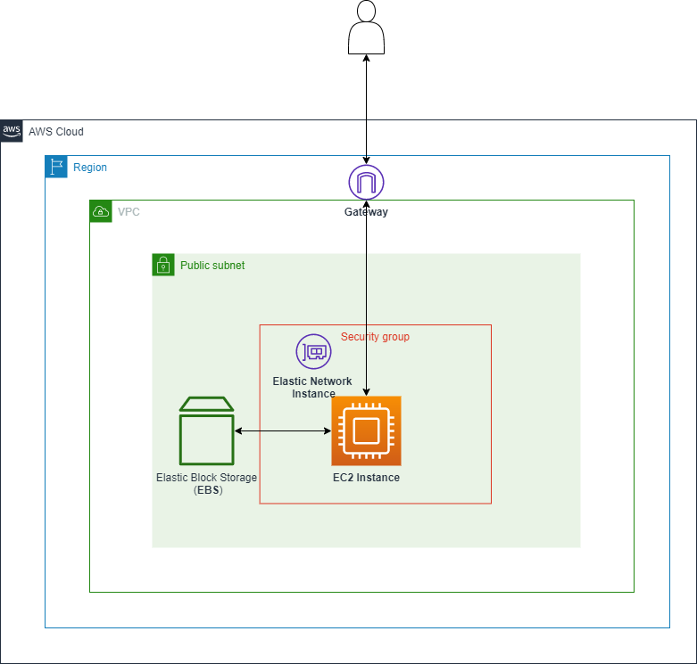

# EC2

- IaaS
- Regional service
- Has an AMI (Amazon Machine Image)
- Can use ***Instance Store Volume***: they are not persistent and not secure
- Instance families
  - **General purpose:** great for diversity of workloads such as web servers or code repositories
    -  Balance between: memory, storage and networking
  - **Compute optimized:** for compute-intensive tasks that require high performance processors 
  - **Memory optimized:** fast performance for workloads that process large datasets in memory 
  - **Storage optimized:** for storage intensive tasks that require high, sequential read and write access to large data 
    sets on local storage 
  - **Accelerated computing**

## EC2 Princing

- **On-demand**
  - Low cost and flexibility of Amazon EC2 without any upfront payment or long-term commitment 
  - Good fot the short-term (test use cases)
- **Reserved Instances (RI)**
- **Spot Instances:** can be terminated at any time
- **Dedicated**
  - Most expensive
  - Multi-Tenant (virtual isolation with other consumers) vs Single Tenant (physical isolation with other consumers)
  
## Instance store volume

- Volume attached to EC2
- Offers some performance because is located in the same host as the instance
- It's ephemeral, if the instance remove the storage is removed too

## Elastic Block Store (EBS)

- A **virtual hard drive** in the cloud
- Create new volumes attach to EC2 instances
- Backup via snapshots
- Can be encrypted
- **IOPS ??**
- **Types ??**
  - 
- Size and the type can be changed without downtime
- Can be copied from zone to author one
- **Snapshot**
  - Create backup of the volume
  - Data is copied from EBS to S3, and they are ***replicated***
  - Best practice: shutdown the instance before making the snapshot
  - Can be private or public
  - Stores only the difference between two **successes!!** snapshot
- **Data Lifecycle Manager**
  - Used to automate the creation of the snapshot

## Security Group (SG)

- A maximum **Five** Security Group per ***Elastic Network Interface (ENI)***
- Two types of rules: ***Inbound*** and ***Outbound***
- **Important** the two rules have ***Hidden Rule*** which is **Default Deny Rule**
- The traffic is stateful. We have juste to allow it in one direction
- Can reference another SG
- An SG can reference itself. Allow the services in the same groups to communicate between them
- You can change the security groups for an instance when the instance is in the **running** or **stopped** state

## User data

- It's a boostrap script
- Uses th url: **http://169.254.169.254/latest/user-data**

## Instance Metadata

- Allows an application to get the information about the instance
- Uses th url: **http://169.254.169.254/latest/meta-data**

## Auto-Scaling

- Define a template
- Network and purchasing
- ELB configuration
- Set scaling policy
  - **Dynamic scaling**
    - Target Tracking Scaling: Increase and decrease the current capacity of the group based on a **Amazon CloudWatch metric and a target value**
    - Step Scaling: increase and decrease based on a **set** of scaling adjustment
    - Simple Scaling (Not recommended): increase and decrease based on a **single** scaling adjustment, with cooldown period between each scaling activity
  - **Scheduled scaling**
    - Anticipate scaling based on known usage pattern (at 10 am increase capacity to 5 instances)
  - **Predictive scaling**
    - Continuously forecast load and schedule scaling ahead
- Notification
