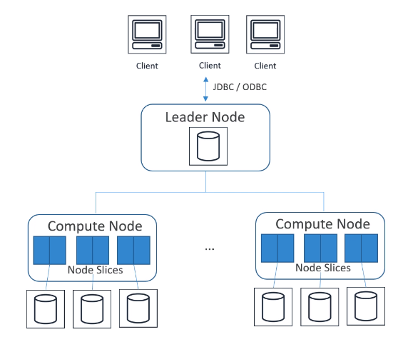

# Redshift

- Fully managed 
- It's OLAP engine (analytics and data warehousing)
- Petabyte-scale data warehouse service 

## Architecture

- Performance
  - Massively Parallel Processing (MPP)
  - Columnar Data Storage
  - Column Compression (is column level operation, reduce space, reduce disc I/O)
- Is a single AZ 
- Block size of 1MB
- Indexes are materialized but not required
- Data is stored in three different places:
  - Original data within cluster
  - Backup within cluster
  - Backup in S3

- **Durability**

- **Distribution Styles**
  - AUTO
  - EVEN
  - KEY
  - ALL

- **Sort Keys**
  - Single column
  - Compound (default)
  - Interleaved

## COPY command

- From S3, EMR, DynamoDB, remote hosts to Redshift
- S3 requires a manifest file and IAM role

- **UNLOAD command:** unload from a table into files in S3