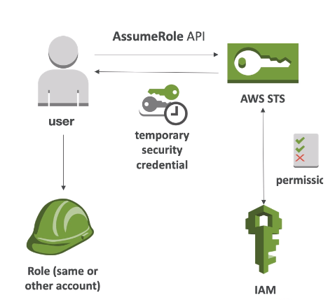

# Security Token Service (STS)

* Allows to grant limited and temporary access to AWS resources
* Token is valid for up to one hour (must be refreshed)

### Cross Account Access

* Define an IAM Role for another account to access
* Define which accounts can access this IAM Role
* Use AWS STS to retriecve credentials and impersonate the IAM Role you have access to (AssumeRole API)
* Temporary credentials can be valid betweeen 15 minutes to 1 hour

