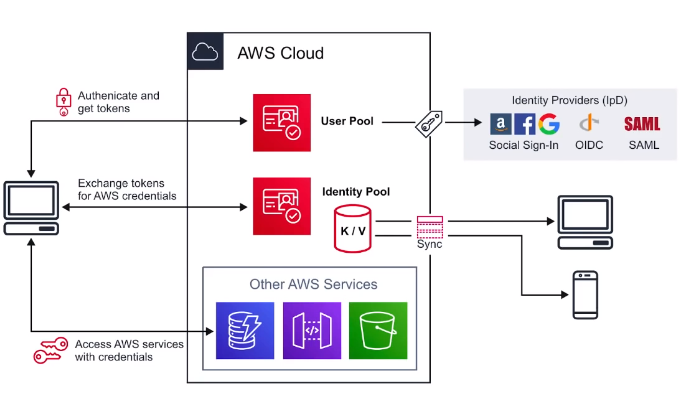
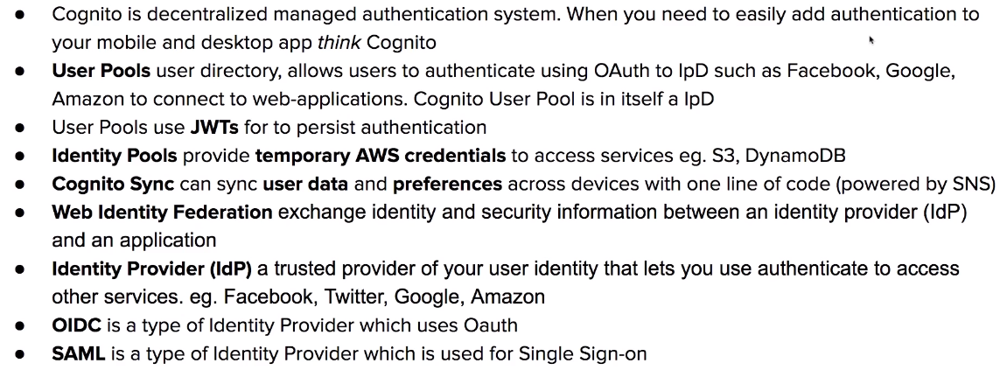

# Cognito

- Decentralized managed way for authentication
  - Sign-in, sing-up for you app
  - Social identity provider Facebook,..
- Authentication process
  1. Authenticate and get tokens
  2. Exchange tokens and get AWS credentials
  3. Access AWS service using credentials

- **Web Identity Provider**: exchange identity and security information between ***IdP*** and Application
- **Identity Provider:** Facebook, GitHub,...
- **Types**
  - SAML is of type Single Sign On (SSO)
  - OpenID
  - OAuth

- **User pools**
  - Decentralized repository of users
  - Handles the actions
    - Sign-in
    - Sign-up
    - Account recovery
    - Account confirmation

- **Identity pools**
  - Provides ***temporary AWS credentials*** to access services eg. S3, DynamoDB, ...
  - It is generated using SDK

  

- **Cognito Sync**
  - Sync ***user data***  and ***preferences*** across devices with one line of code
  - Uses:
    - **Push synchronization** to push updates and synchronize data
    - Simple Notification Service (SNS) to send notifications to all user devices when data in cloud changes

    

## Conclusion

