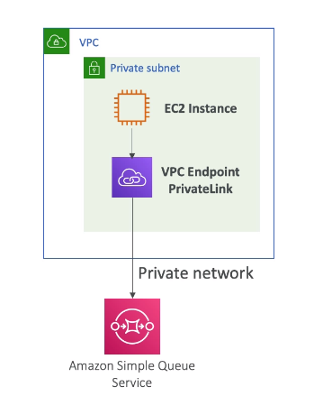

# VPC Endpoints

- Allows to connect to AWS Services using private network instead of the public www network
- They scale horizontally and are redundant
- They remove the need of IGW, NAT, etc ... to access AWS Services
- Two types:
  - **Gateway:**
    - Provisions a target and must be used in a route table
    - Only **S3** and **DynamoDB**
  - **Interface**
    - Provisions an ENI (Private IP address) as an entry point (must attach security group)
    - Most AWS Services  
    - Also called **VPC PrivateLink**

