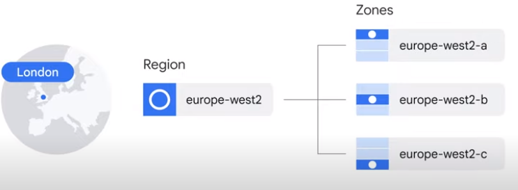
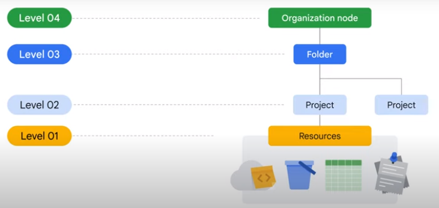

# Basics

- [Compute](#compute)
    -  [App Engine](#apengine)
    -  [Compute Engine](#computeangine)
    -  [Kubernetes Engine](#kubernetes)
    -  [Cloud Functions](#functions)

- [Network](#network)
- [Data Transfert](#datatransefert)

## Compute 

### App Engine 

- Is Paas (Platform as Service)
- Auto scaling and and Load-Balancing
- Two environments:
  - Standard
  - Flexible

### Compute Engine 

- Is IaaS (Infrastructure as Service)
- Scalable and high perforamnce VMs
- Two types instances group:
  - Managed: collection of instances that are identical
  - Unmanaged: collection of instances with different config
- For each VM that runs for more than 25% of a month, Compute Engine automatically applies a discount for every additional minute

### Cloud Functions 

- Runs in response to the event
- Serverless
- Pay for CPU and RAM
- Each function get HTTP endpoint

## Network 

- Composed of locations
- Locations are devided into Regions
- Regions are composed of Zones

 Source: GCP

### VPC

Is a secure, individual, private cloud-computing model hosted within a public Cloud.

### Load Balancer

### Cloud CDN

- Accelerate delivery from Compute Engine and Cloud Storage
- Lower latency

## Data Transfert 

- **Data Transfert Appliance**
  - Transfert data from external storage to cloud
- **Data Transfert Appliance**
  - Transfert data from cloud to cloud

## Serverless

- Cloud Functions
- Cloud Run

## Hierarchy

- Resource
  - Belongs to only one project
- Project
  - Project ID
  - Project Name
  - Project number
- Folder
  - Folder's policies are inhireted by the project

     Source: GCP
