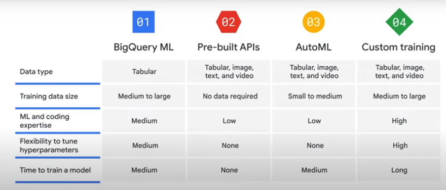
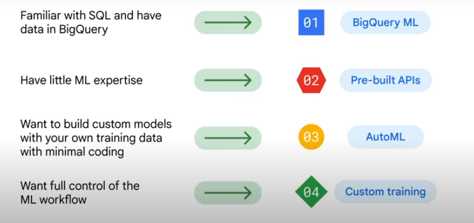
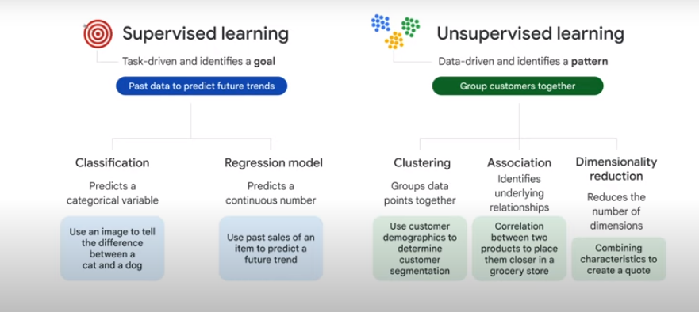

# ML in GCP

It offers four options to build ML models
- **BigQuery ML:** uses sql query to create ml models
- **Pre-Builds APIs:** programming options 
- **Auto ML:** no code options to build models on Vertex AI
- **Custom training:** custom environment

- [source]: google training session

## How to choose ?

## Pre-Builds APIs

- Neutral Language API
- Extract entities
  - Detect sentiments
  - Analyze syntax
  - Classify content
  - Vision API
    - Lab & web detection
    - Logo detection
    - Landmark detection
    - Crop hints
    - Explicit content detection

- Cloud Speech-to-Text API
  - Three types of reorganization
    - Synch (REST and gRPC): 1 minute or less
    - Asynch (REST and gRPC): up to 480 minutes
    - Streaming (gRPC): for real-time speech
  - Sample rate between 8000 Hz and 48000 Hz
  - Recommended 16000 Hz
  - No need to resample existing audio

## AutoML

- Transfer learning 
- Neural Architecture Search: find the optimal model for the relevant project.

## Custom training

- Vertex AI Workbench
  - Pre-built container: Tensorflow, Pytorch, Scikit-learn, ...
  - Custom container

## Vertex AI

1. Data preparation
   - Upload data: text, tabular, image, video, 
   - Feature engineering
2. Train model 
   - Model training 
   - Model evaluation

- [source]: google training session

3. Model serving 
   - Model deployment 
   - Model monitoring 