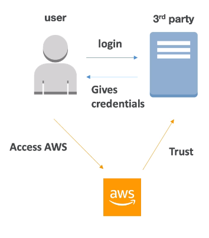

# Identity Federation

- Let outside users of AWS to assume temporary role for accessing AWS resource
- These users assume identity provided access role
- Federation assumes a form of 3rd party authentication, could be:
  - LDAP
  - Microsoft Active Directory (~= SAML)
  - Single Sign On
  - Open ID
  - Cognito

- Using federation, you don't need to create IAM users (user management is outside of AWS)

- **QST** May ask for given identity federation
- **SAML Federation**
- **Custom Identity Broker Application**
- **AWS Cognito - Federation Identity Pools**

    