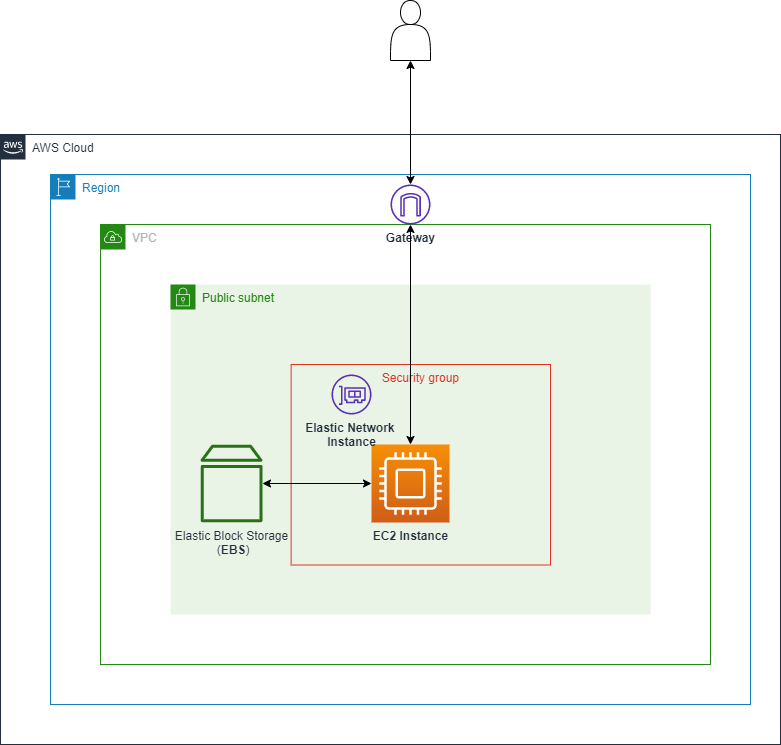

# EC2

## What's EC2

- IaaS
- Regional service
- Has an [AMI](#ami-amazon-machine-image) (Amazon Machine Image)
- Can use ***Instance Store Volume***: they are not persistent and not secure

## Instance families

- **General purpose:** great for diversity of workloads such as web servers or code repositories
  - Balance between: memory, storage and networking
- **Compute optimized:** for compute-intensive tasks that require high performance processors
- **Memory optimized:** fast performance for workloads that process large datasets in memory
- **Storage optimized:** for storage intensive tasks that require high, sequential read and write access to large data sets on local storage
- **Accelerated computing**

## EC2 Princing

- **On-demand**
  - Low cost and flexibility of Amazon EC2 without any upfront payment or long-term commitment
  - Good fot the short-term (test use cases)
- **Reserved Instances (RI)**
- **Spot Instances:** can be terminated at any time
- **Dedicated**
  - Most expensive
  - Multi-Tenant (virtual isolation with other consumers) vs Single Tenant (physical isolation with other consumers)
  
## Instance store volume

- Volume attached to EC2
- Offers some performance because is located in the same host as the instance
- It's ephemeral, if the instance remove the storage is removed too

## Elastic Block Store (EBS)

- A **virtual hard drive** in the cloud
- Create new volumes attach to EC2 instances
- Backup via snapshots
- Can be encrypted
- **IOPS ??**
- **Types ??**
- Size and the type can be changed without downtime
- Can be copied from zone to author one
- **Snapshot**
  - Create backup of the volume
  - Data is copied from EBS to S3, and they are ***replicated***
  - Best practice: shutdown the instance before making the snapshot
  - Can be private or public
  - Stores only the difference between two **successes!!** snapshot
- **Data Lifecycle Manager**
  - Used to automate the creation of the snapshot

## Security Group (SG)

- A maximum **Five** Security Group per ***Elastic Network Interface (ENI)***
- Two types of rules: ***Inbound*** and ***Outbound***
- **Important** the two rules have ***Hidden Rule*** which is **Default Deny Rule**
- The traffic is stateful. We have juste to allow it in one direction
- Can reference another SG
- An SG can reference itself. Allow the services in the same groups to communicate between them
- You can change the security groups for an instance when the instance is in the **running** or **stopped** state

## User data

- It's a boostrap script
- Uses th url: **http://169.254.169.254/latest/user-data**

## Instance Metadata

- Allows an application to get the information about the instance
- Uses th url: **http://169.254.169.254/latest/meta-data**

## Auto-Scaling

- Define a template
- Network and purchasing
- ELB configuration
- Set scaling policy
  - **Dynamic scaling**
    - Target Tracking Scaling: Increase and decrease the current capacity of the group based on a **Amazon CloudWatch metric and a target value**
    - Step Scaling: increase and decrease based on a **set** of scaling adjustment
    - Simple Scaling (Not recommended): increase and decrease based on a **single** scaling adjustment, with cooldown period between each scaling activity
  - **Scheduled scaling**
    - Anticipate scaling based on known usage pattern (at 10 am increase capacity to 5 instances)
  - **Predictive scaling**
    - Continuously forecast load and schedule scaling ahead
- Notification

## AMI (Amazon Machine Image)

- AMIs are built for a specific AWS Region, they're unique for each AWS Region. You can't launch an EC2 instance using
  an AMI in another AWS Region, but you can copy the AMI to the target AWS Region and then use it to create
  your EC2 instances.
- Contains
  - Snapshots, permissions and block device mapping
  - Best practice: Stop the image before creating the image
- Can be:
  - Private
  - Public
  - We can add account to use the image
- Advantage of using AMI
  - IAM pre-backing ??
  - Immutable IAM ??
- Used when we need just static provisioning

## Boostrap

- Give an EC2 instance a series of instructions to do (Customize an instance)
- We can use:
  - Bash (linux) powershell (windows) file
  - Cloudinit file
- Used to dynamically provision an instance

## Network

## Elastic IP

- Allows to allocate IP address to an instance
- You can only have 5 Elastic IP in the account (Ask AWS to increase the number)

## Placements group

A way to logically grouping instances

- **Cluster**
  - 1 AZ
  - Good for High Performance Application
- **Spread**
  - Each instance is placed on a different rack
  - When critical instances should be keep separate from each other
  - You can spread a max 7 instances. Spreads can be multi-AZ
- **Partition**
  - Spread instances across partitions
  - Each partition do not share the underlying hardware with each other (rack per partition)
  - Well suite for large distributed and replicated workloads (Hadoop, Cassandra, Kafka)

### ENI (Elastic Network Interface), IP, and DNS

- For day-to-day networking (Which gives EC2 instance networking connectivity)
- It provides
  - Private IPv4 addresses (one primary private IPv4 and one or more secondary private IPv4)
  - Public IPv4 address
  - Many IPv6 address
  - MAC address
  - One or more Security Groups
  
- Public instance
  - Has public IP
  - Public IP is changed when an instance is stopped
- Private instance
  - Private IP doesn't change

### EN (Enhanced Network)

- Enhanced networking uses single root I/O virtualization (SR-IOV) to provide high-performance networking capabilities on supported instance types. 
- SR-IOV is a method of device virtualization that provides higher I/O performance and lower CPU utilization when compared to traditional virtualized network interfaces.
- Enhanced networking provides:
  - **Higher bandwidth**
  - **Higher packet per second (PPS) performance**
  - **Consistently lower inter-instance latencies**
- There is no additional charge for using enhanced networking.

### EFA (Elastic Fabric Adapter)

- Accelerates High Performance Computing (HPC) and machine learning applications

## Launch Template

- IAM type
- EC2 role
- SG

## Outposts
