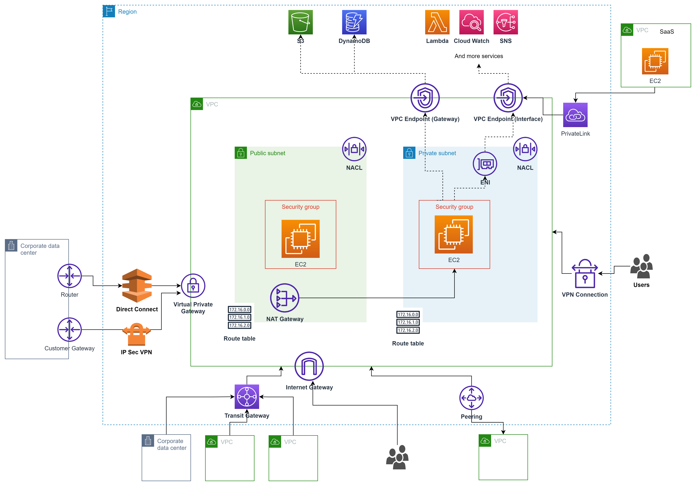

# Virtual Private Cloud (VPC)

## Subnet

- Is a virtual firewall
- ex: eu-west has 3 AZ => 3 subnets
- By default, is private
- A subnet is always assigned to one AZ

## Internet Gateway

- Allows resources (e.g: EC2 instances) inside VPC to connect to internet
- High available and scale horizontally
- VPC can be only attatch to one Internet Gateway and vice-versa
- IGT in their owen they do not allow access to internet they need to to associated to the [Route Table](#route-table)
- It's responsible for a **_Static Network Address Translation_** (translate private ip to public ip)

## Route Table

- Determines where network traffic is directed in a VPC
- A VPC can have multiple route tables
- Each subnet must be associated with exactly one route table. If no association is made, the subnet uses the main route table
- Controls how the VPC Router forwards traffic leaving a subnet

## Security group

- We can add any **_allowing_** rules (open ports)
- It's linked to instances
- They are **stateful**
- Default SG can't be deleted
- You can assign up to five security groups to the instance
- Can allow traffic from:
  - Range or individual IP address
  - Another security group
  - Rules are permissive
- Can have
  - Up to 10000 SG per region (default 2500)
  - 60 inbound and outbound rules per SG
  - 16 SG per Elastic Network Interface

## Network Access Control Lists (NACLs)

- Is an optional layer of security for VPC that acts as a firewall controlling traffic in and out of one or more subnets
- It is used to **block** specific IP address or range of IP address
- Can **_allow_** and **_deny_** rules
- It can have multiple subnets but a subnet is only associated to only one NACLs
- They are **stateless**
- Default rule cannot be updated

## VPC Peering

- Link VPCs together using private network
- Allows you to connect 1 VPC with another via a direct network route using private IP address
- Instances behave as they were in the same VPC
- We can peer between different AWS account (cross-account) and different regions
- Transitive peering is not supported
- No overlapping CIDR address ranges
- Data is encrypted

## NAT Gateway

- Access internet from private subnet
- One sense private subnet **==>** internet
- Redundant inside AZ
- Start at 5 Gbps and scales currently to 45 Gbps (Bandwidth)
- No need to patch
- No associated to Security Group
- Automatically assigned a public IP address

## VPC Endpoints (AWS PrivateLink)

- Access AWS services privately from private subnet, without public IP, IGW or NAT.
- Two types
  - Interface endpoints
  - Gateways endpoints (Support connection to S3 and DynamoDB)
- Doesn't need VPC Peering, public internet, NAT Gateway, Route Tables
- Must be used with Network Load Balancer & ENI

## VPC Flow logs

- Allow to capture IP traffic information in-and out of Network Interfaces within a VPC
- Can be created for:
  - VPC
  - Subnets
  - Network Interface
- Track the logs
- Cannot be tagged as other resources
- Contains source and destination IP addresses

## Difference Security Group and NACLs

- Security groups are assigned to a specific resource, while NACLs are assigned to a subnet
- Security groups do not allow explicit denies, while NACLs do
- Security groups are stateful, while NACLs are stateless

## Direct Connect (DX)

- Establish a dedicated network connection from on-premise to AWS
- Two types
  - Dedicated connection ??
  - Hosted connection ??
- Useful for high throughput workloads
- Helpful when you need stable and reliable secure connection  

## Site-To-Site (VPN Connection)

- Utilizes IPSec to establish **encrypted** network connectivity between your intranet and Amazon VPC over the Internet
- VPN Connections can be configured in minutes and are a good solution if you have an immediate need have low-to-modest 
 bandwidth requirements, and can tolerate the inherent variability in Internet-based connectivity
- **Customer Gateways**: Created on-premise side
- **Virtual Private Gateway**: Created on AWS side

## AWS Wavelength

- AWS service embeds AWS compute and storage services within 5G networks, providing mobile edge computing infrastructure 
 for developing, deploying, and scaling ultra-low-latency applications

## Bastion (Jumpbox)

- Get access via SSH to private subnet

## Endpoints

### Interface Endpoints

- They are **Elastic Network Interfaces (ENI)** with private IP address
- They serve as an entry point for traffic going to a supported service

### Gateway Endpoints

- Is a target for a specific route in the route table
- Supports only **DynamoDB** and **S3**

## CloudHub

- Connect multiple sites
- Low cost and easy to manage
- It operates over public network, but all traffic between Customer Gateway and AWS VPN CloudHub is encrypted

## Transit Gateway

- Connects VPCs and on-premise networks through a central hub (single gateway)
- Scales elastically based on the volume of network traffic
- Routing through a transit gateway operates at **layer 3**, where the packets are sent to a specific next-hop attachment, based on their destination IP addresses

## Egress-only Internet Gateway

- Used for IPv8 only
- Similar to a NAT Gateway but for IPv6
