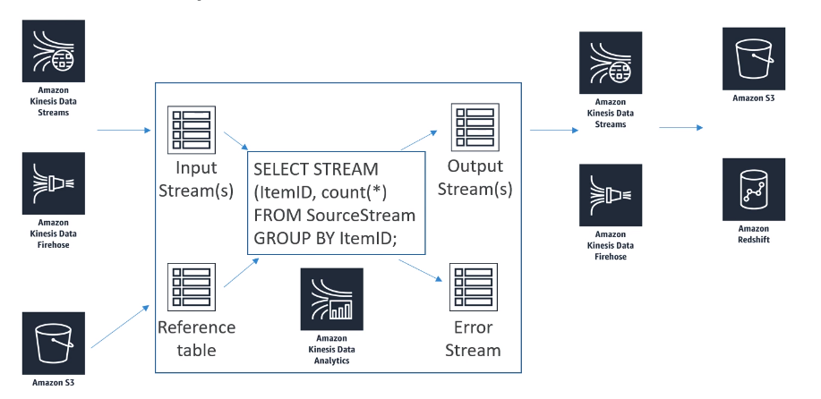

# Kinesis 

- **Kinesis Streams** 
  - Real-time for ingesting data 
  - You're responsible for creating the consumer and scaling the stream 
- **Data Firehose**
  - Data transfer tool to get information to S3, Redshift, ELK or splunk 
  - Near real-time (60 seconds)
  - Plug and play with AWS architecture

- Performs real-time analysis on streams using SQL

- **Common use-cases**
  - Streaming ETL 
  - Continues metric generation 
  - Responsive analytics

## Cost
- Pay only for resources consumed (but it's not cheap)
- Serverless; scales automatically 
- Use IAM permissions to access streaming source and destination(s)
- Schema discovery
- **RANDOM_CUT_FOREST**
  - SQL function used for anomaly detection on numeric columns in stream 
  - They're especially proud of this because they published a paper on it 
  - it's a novel way to identify outliers in data set, so you can handle them however you need to 
  - Example: detect anomalous subway ridership during the NYC marathon
