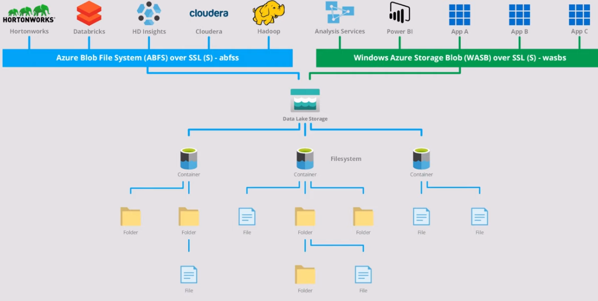

# Data Lake Storage (Gen 2)

## Data lake
- Hadoop compatible access
- A superset of POSIX permissions
- Optimized driver 

## Blob Storage
- Low cost
- Storage tiers (Hot, cold, archive)
- High availability and disaster recovery

## Access Control
- Supports 
  - Azure RBAC
  - POSIX-like Access Control List (ACL) 
    
## Architecture

