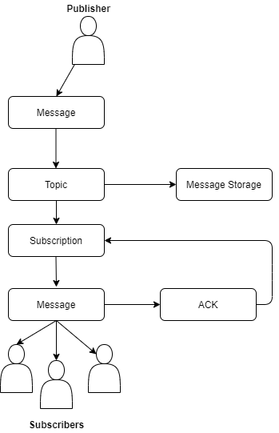

# Pub/Sub

- Distributed messagin service
- Serverless
- Global scale message buffer/coupler
- No-ops, global availability and auto-scaling
- Decouple sender and receiver
- Guarantee **At-last-once** delivery
- exaclty-one delivery can only be available for pull method
- Asynchronous messaging (ex: many-to-many) or other combination
- Message are stored in **Message Storage**
- Ensure end-to-end encryption (in-transit and rest)
- Kafka Connect can be useb to link PubSub to Kafka
- Supports many inputs and outputs

- Patterns
  - One publisher to one subscriber
  - Fan-in or loadbalancer: multiple pub and multiple sub
  - Fan-out: one pub to multiple sub

## Pull

- Subscriber must send and ack to the topic.
- Messages are stored up to 7 days.

## Push

Subscriber respond only with 200 OK for HTTP call that tell to Pub-Sub the message delivery was successful.



## Commands

- Pull: ```gcloud pubsub subscriptions pull sub-name --auto-ack```

## IAM

## Example

```bash
gcloud pubsub topics create sandiego
gcloud pubsub topics publish sandiego --message "hello"
gcloud pubsub subscriptions create --topic sandiego mySub1
gcloud pubsub subscriptions pull --auto-ack mySub1
gcloud pubsub subscriptions delete mySub1
```
