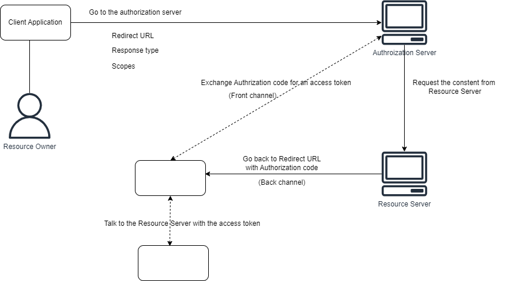

# Oauth2

- Authorization framework
- Two endpoints
  - Authorization: handles interactions via user agent (browser)
  - Token: meant for machines only
- Scope: a permission to do something within an API
- Grant Type
  - Code
  - Implicit
  - ...
- Response type
  - Token
  - Token type
  - Expiration (expires_in)
  - Scopes
