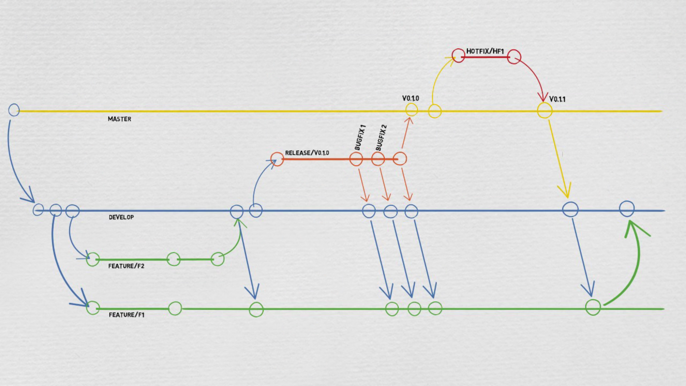

## Git flow
Uses two branches
- Master: used for production releases.
- Develop: contains stable features for the next releases.

Other special branches are used
- Feature: the develop branch is its parent
- Release: develop is its parent, and it used to indicate the end of development phase
- HostFix: 
    - Used to correct bug in prod.
    - Master its parent (forked from master)
    - Merged to master and develop at the end
  

