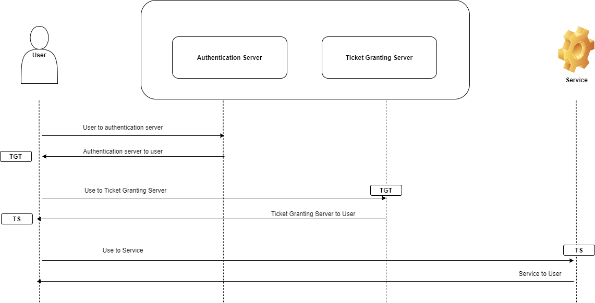

## Kerberos concepts

- **Principal**: an identity that needs to be verified
	- User Principal Names (UPN)
	- Service Principal Names (SPN)

- **Realm**: A realm in Kerberos refers to an authentication administrative domain.
  Principals are assigned to specific realms in order to establish boundaries and simplify administration

- **Key distribution center (KDC)**: contains all information about principals and realm. It consists of:
    - ***Kerberos database:*** it stores  
        - UPN and SPN
        - To which realm principal belongs to
        - Encryption keys
        - Tickets validation duration
        - Expiration date
        - ...
	- ***Authentication Server (AS):***
	    - Delivers TGT (Ticket Granting Ticket)
	    - Authenticates users
        - TGT is delivered if authentication is successful
	- ***Ticket Granting Server (TGS):***
        - Validates **TGT**
	    - Delivers TS (Ticket Service)
- **KeyTab:** file that contains all keys related to specific service





## Principal parts

- **Primary:** ```username@EXAMPLE.COM``` => user belongs to realm EXAMPLE.COM
- **Instance:** ```username/admin@EXAMPLE.COM```
- **Service:** ```hdfs/node1.domain.com@EXAMPLE.COM``` => service ```hdfs``` in the node ```node1.domain.com```
- **PS**: naming is **case-sensitive**

## Types

- **One way**

- **bidirectional trust or full trust**

## Advantages

- Is Single sign on
- Password do not travel in clear over the network
- A centralized repository for all users and services credentials 

## Example: Access hdfs

1. Authenticate using ***kinit*** service
2. Sends authentication to Authentication Server
3. If OK: AS sends TGT to user and ***kinit*** will store TGT in a credential cache and user is Authenticated
4. Now user wants to run command ```hdfs dfs -ls ```
    1. Hadoop will use TGT and reach Ticket Granting Server
    2. TGS will grant TS (Ticket Service) and client will cache TS
5. Hadoop RPC will use TS to reach the Namenode
6. Client and Namenode exchange Tickets (Client ticket prove client identity and Namenode determines the identification of Namenode)

### Kerberos on Hadoop

1. Create KDC
2. Create service principal for each service (HDFS, Yarn, ...)
3. Create Encrypted Kerberos Keys (Keytabs) for each service
4. Distribute keytab for service principals to each service on the cluster nodes
5. Configure all services (HDFS, Yarn, Hive, ...) to rely on Kerberos

## Installation

### Server Side

**1. Install Kerberos Admin Server:** install the server and KDC

```yum install krb5-workstation krb5-libs krb5-server```

**2. Configure Kerberos**

- Two configuration files
  - `/etc/krb5.conf`
  - `/var/kerberos/krb5kdc/kdc.conf`

- **Configure the realm**

    ```
    sudo echo
    [realms]
     HADOOP.COM = {  
      kdc = server.hostname.com
      admin_server = server.hostname.com 
     } > /etc/krb5.conf 
    ```

```
[realms]
 # realm name
 HADOOP.COM = {  
  # the name of KDC
  kdc = server.hostname.com
  # The admin Server
  admin_server = server.hostname.com 
 }
```

* **Configure KDC**

```vi /var/kerberos/krb5kdc/kdc.conf```

**4. Create KDC database**

```sh
    kdb5_util create -r HADOOP.COM -s
```

**5. Specify the admin principals and add admin principal**

- All users in realm ```*/admin@HDPCLUSTER.COM``` will have admin access
- ```kadmin.local``` utility used only on the krb server

```sh
vi /var/kerberos/krb5kdc/kadm5.acl
kadmin.local -q "addprinc root/admin"
```

**6. Start kdc and the server**

```
service krb5kdc start
service kadmin start
```

**7. Test**

```sh
# list if ticket is present in cache
klist

# get ticket
kinit username

# add principal
kadmin
addprinc username@REALM.COM
```

### Client Side

1.***Install***

```yum install krb5-workstation krb5-libs krb5-auth-dialog```

### Useful links

```
- https://examples.javacodegeeks.com/enterprise-java/apache-hadoop/hadoop-kerberos-authentication-tutorial/
- https://www.oreilly.com/library/view/hadoop-security/9781491900970/ch04.html
```
